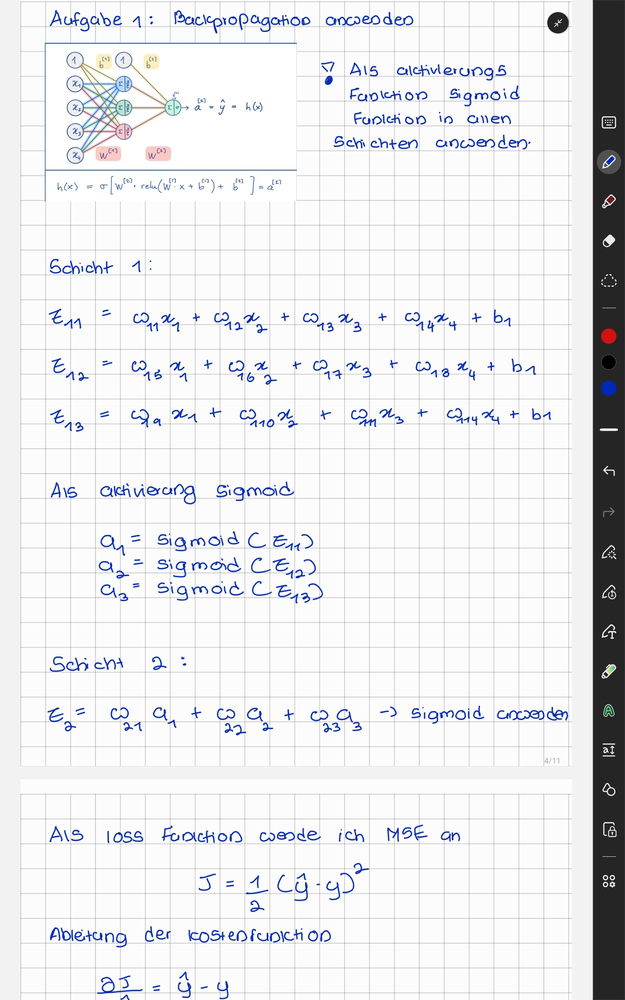
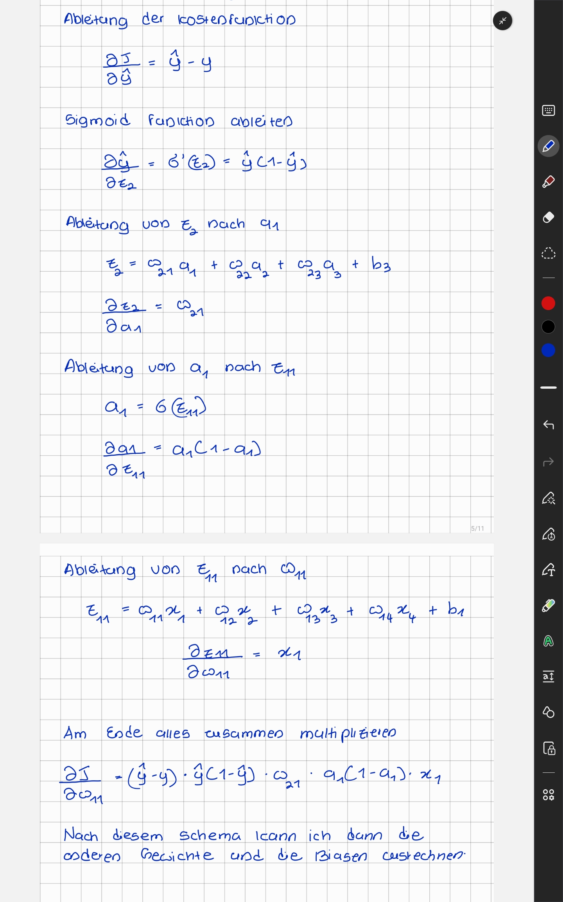
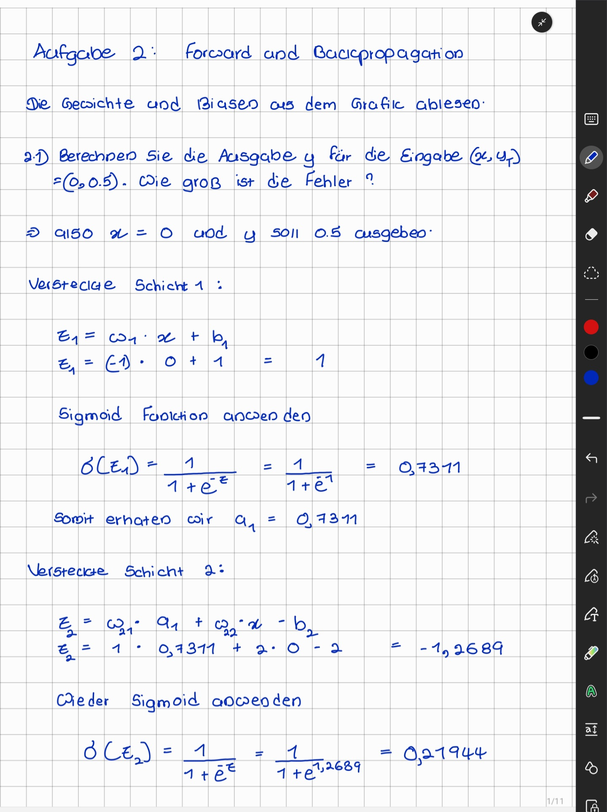
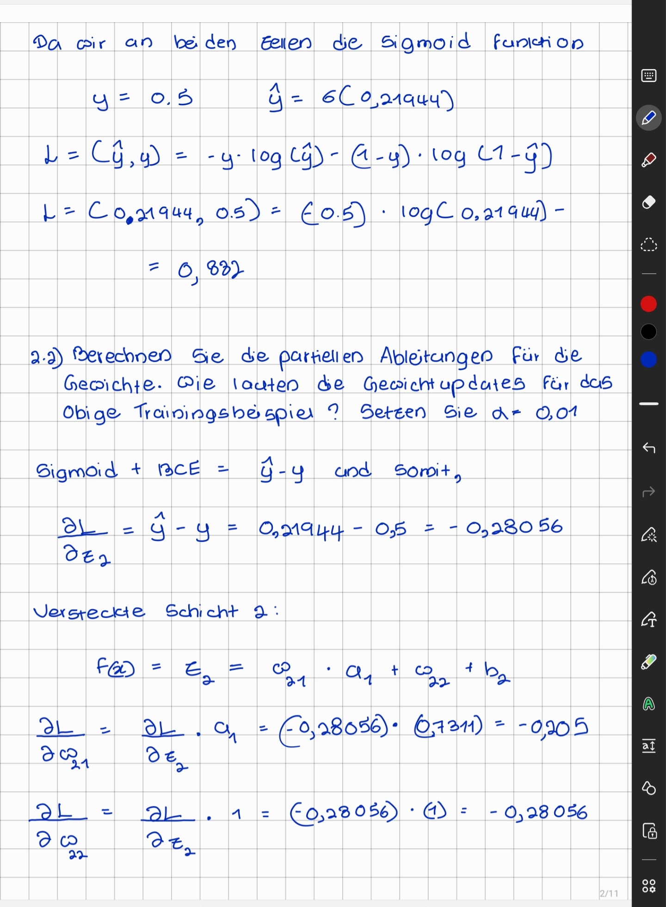
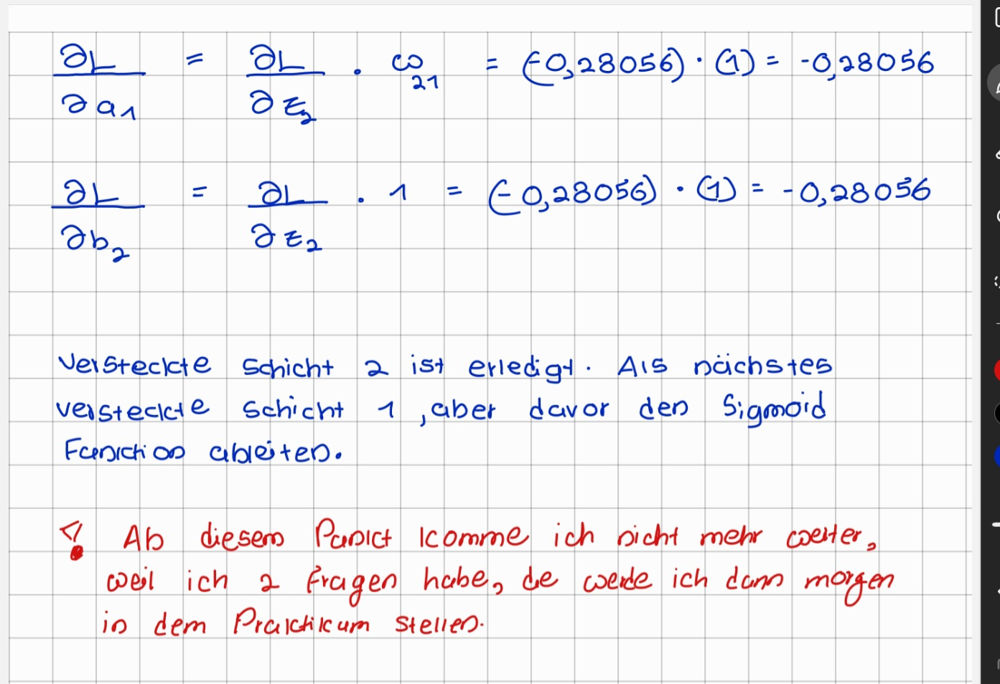

<h1>Backpropagation</h1>

<h2>NN.Backprop.01: Gewichtsupdates für versteckte Schichten </h2>

<h2>NN.Backprop.02: Forward- und Backpropagation</h2>

<h2>NN.Backprop.03: MLP und Backpropagation </h2>

MLP und Backpropagation.py Datei

